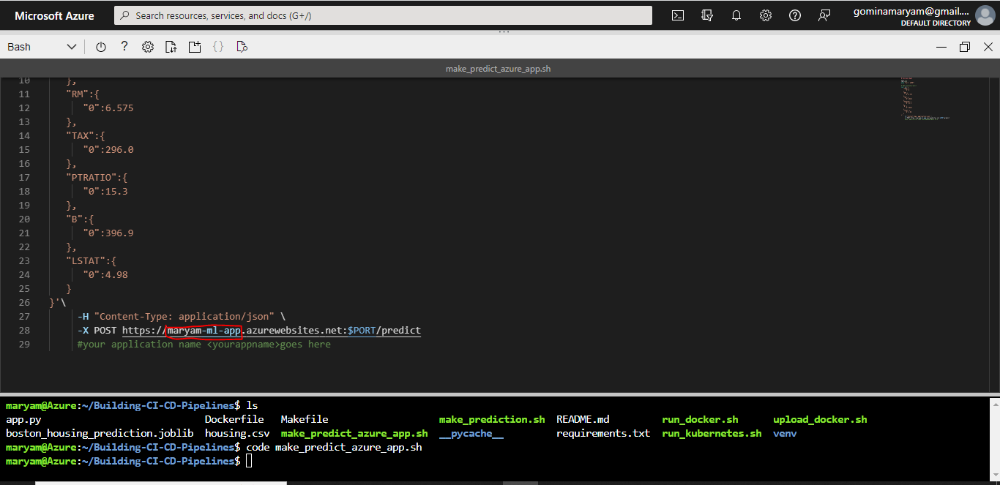

[](https://github.com/AnimogM/Building-CI-CD-Pipelines/actions/workflows/main.yml)

[](https://dev.azure.com/gominamaryam/Building-CI-CD-Pipelines/_build/latest?definitionId=5&branchName=main)

# Overview

This project Setup is on a Continuous Integration/Continuous delivery pipeline for a Python-based machine learning application using the Flask web framework. 

## Project Plan

* [Trello Board](https://trello.com/b/cR9AsSan/building-ci-cd-pipelines)
* [Spreadsheet](https://docs.google.com/spreadsheets/d/1r_i2YUUxIhJHdwbEXnrKBMqAsQNpRtdRkwwxW2Rk1qY/edit?usp=sharing)

## Instructions
 
* Architectural Diagram (Shows how key parts of the system work)


## Launch Azure Cloud Shell
- login to azure portal at https://portal.azure.com/ and open the cloud shell


## Generate SSH key and upload the public key to github

```
ssh-keygen -t rsa
```

**NOTE:** use ```cat ~/.ssh/id_rsa.pub``` if you have generated it before


## Clone the repository using Azure Cloud Shell

```
git clone git@github.com:AnimogM/Building-CI-CD-Pipelines.git
```


## Create a new python virtual environnement

```
cd Building-CI-CD-Pipelines
```
```
python3 -m venv venv
```
```
source venv/bin/activate
```

## Install dependencies and build the app

```
make all
```


## Setup Github Actions


## Create Azure App Service

```
az webapp up --sku F1 -n maryam-ml-app
```


## Setup Azure DevOps

- Go to https://dev.azure.com and sign in.
- Create a new private project.
- Under Project Settings create a new service connection and select Azure Resource Manager.
- Create a Python-specific pipeline to deploy to App Service, and linked it to your GitHub repo.


## Get app logs

```
az webapp log tail
```


## Test the app is up and running

- set the app name inside **make_predict_azure_app.sh** file




``` ./make_predict_azure_app.sh
```


 

* Output of streamed log files from deployed application


## Enhancements

It an be improvedon by having multiple environments (Dev, Staging and Production) and have a pipeline for each environment.


## Demo 

https://youtu.be/S4hdH8pHzoA


